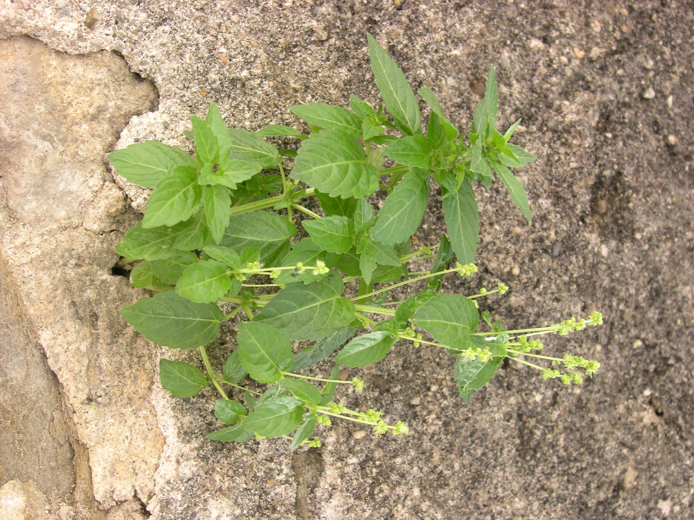
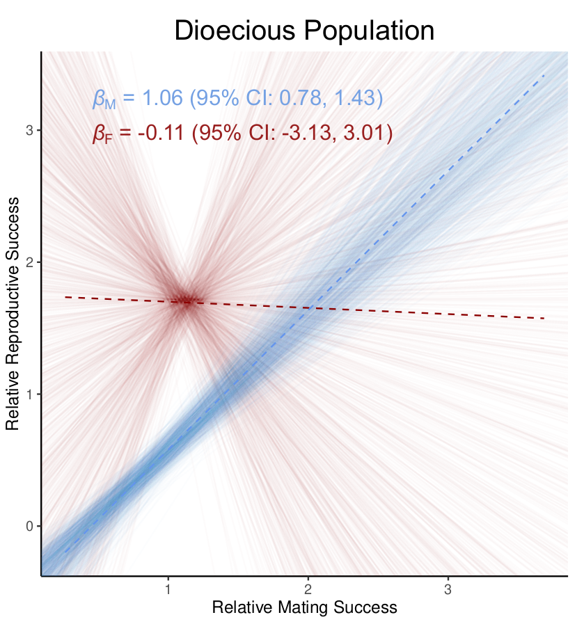
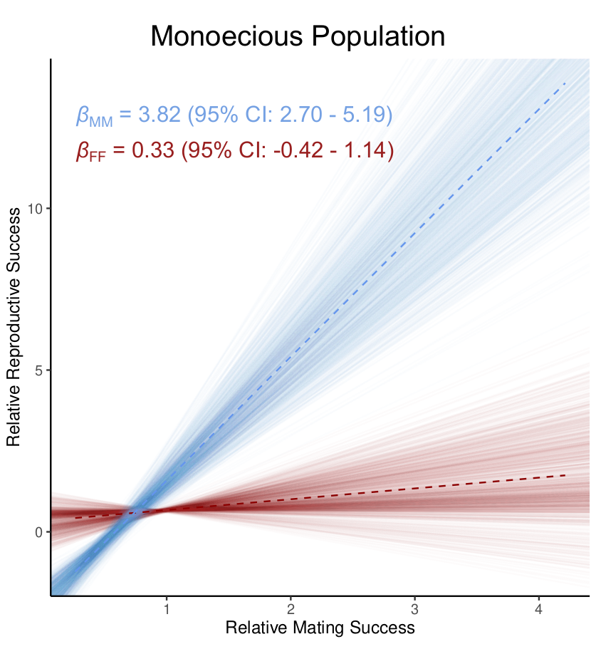

```{r setup, include=FALSE}
knitr::opts_chunk$set(echo = TRUE, message=FALSE, warning=FALSE)
knitr.table.format = "html"

rm(list = ls())
library( knitr )

```

background-image: url("Drosophila.jpg")
background-size: 910px
background-position: bottom center

# Sexual selection


<small>
<font color="black">
.footnote[Photo: *Drosophila melanogaster*; Amy Xinyang Hong and Cedric Tan]
</font>
</small>

???
Angus John Bateman
Mechanistic explanation for sexual selection
(1) males have greater variance in mating success
(2) males have greater variance in offspring production (siring success)
(3) as a result there is a tighter association between mating and reproductive success for males than for females

---
background-image: url("bateman.jpg")
background-size: 700px
background-position: middle center

# Bateman gradients & sexual selection

<small>
<font color="black">
.footnote[Janicke et al. (2018) http://dx.doi.org/10.1098/rspb.2018.0173]
</font>
</small>

---
background-image: url("anisogamy.jpg")
background-size: 1300px
background-position: bottom center

# Anisogamy drives sexual selection

???
Recent paper by Jussi Lehtonen ## pronounce Yussy with soft s (between ss and shsh)
theoretical paper that confirmed Bateman's arguments - sexual selection and the so-called Bateman gradient caused by differences in gamete production between females and males

<small>
<font color="white">
.footnote[Photo: cbsnews.com]
</font>
</small>

---
background-image: url("bird_flower.jpeg")
background-size: 1300px
background-position: bottom center

# Sexual selection in plants?

<small>
<font color="white">
.footnote[Photo: wikio]
</font>
</small>

---
background-image: url("Tonnabel.png")
background-size: 750px
background-position: top center

# First direct measure of sexual selection in plants

<small>
<font color="black">
.footnote[Tonnabel et al. (2019) http://dx.doi.org/10.1098/rspb.2019.0532]
</font>
</small>

---

# Sexual selection in this plant?

.pull-left[

## *Mercurialis annua*

### Dioecious
### Wind-pollinated
### Small, inconspicuous flowers
  
]

.pull-right[

.top[

]

]

<small>
<font color="black">
.footnote[Photo: M. Dorken]
</font>
</small>

---
background-image: url("Macrostomum.png")
background-size: 500px
background-position: bottom center

# Sexual selection in hermaphrodites?

<small>
<font color="black">
.footnote[Photo: *Macrostomum lignano*; Grudniewska et al. 2018 https://doi.org/10.1038/s41598-018-21107-4]
</font>
</small>

---
background-image: url("PRSB_Cover_Kwok_Dorken_SexualSelectionSagittaria.png")
background-size: 400px
background-position: middle

# Sexual selection in *Sagittaria latifolia*

<small>
<font color="black">
.footnote[Photo: Proceedings B]
</font>
</small>

---
background-image: url("Sag_MD2.png")
background-size: 910px
background-position: top

# *Sagittaria latifolia* - Monoecious & Dioecious

<small>
.footnote[Photos: M. Dorken, L. Harder]
</small>

---
background-image: url("Slat_LifHist.png")
background-size: 690px
background-position: right

# *Sagittaria latifolia* - clonal growth 

### Reproductive ramets (shoots)
### Genets (clones) can intermingle 
'guerrilla' growth  
(Stephens, van Kleunen & Dorken 2020)
### Vegetative ramets during summer
corms overwinter
### Clone size determined by 
local conditions (Dorken & Barrett 2004)  
clone age (Holt, Kwok & Dorken 2020)

<small>
.footnote[Photos: S. Barrett]
</small>

---
background-image: url("SagF_Sm.png")
background-size: 675px
background-position: right


# Research Questions

.pull-left[

### 1) What is the magnitude of sexual selection in natural populations?
### 2) Is sexual selection stronger in dioecious vs. monoecious populations?

]

.pull-right[
]


<small>
.footnote[Photo: Female *Sagittaria latifolia*; M. Dorken]
</small>

---

# Methods - field and lab work

.pull-left[
### Mapped all flowering shoots
### Genotyped shoots and offspring
7 SSR loci
### Assigned shoots to clones 
RClone 
### Assigned seeds to parents 
Colony2
]

.pull-right[


### Sample sizes 

<br>

.pull-left[

```{r Methods, echo=FALSE, warning=FALSE}

Monoecious = c(167, 140, 33, 360)
Dioecious = c(183, 110, 38, 448)

Methods <- data.frame(cbind(Monoecious, Dioecious))

rownames(Methods) <- c("Shoots", "Clones", "Maternal parents", "Seeds")

kable(Methods, format = "markdown", booktabs=T) 
  
```

]
]


---
background-image: url("SagF2_Sm.png")
background-size: 650px
background-position: right

# Methods - estimating mating & reproductive success


.pull.left[
## Mating success
Number of (genetic) mates per plant

## Reproductive success 
Females: N seeds produced  
Males: paternity share x N mates

## Bateman gradients
Bootstrap resampling of single shoots  
to control for variation in clone size

<small>
<font color="black">
.footnote[Photo: Female *Sagittaria latifolia*; M Dorken]
</font>
</small>

]

.pull.right[]


---
background-image: url("SagMale2.png")
background-size: 575px
background-position: top left

# Results - Bootstrapped Bateman Gradients

.right[

]

<small>
<font color="black">
.footnote[Male *Sagittaria latifolia* flower
<br> Kwok & Dorken (2022) https://doi.org/10.1098/rspb.2022.0919]
</font>
</small>

---
background-image: url("SagMonoecious.png")
background-size: 550px
background-position: top left

# Results - Bootstrapped Bateman Gradients

.right[

]

<small>
<font color="black">
.footnote[*Sagittaria latifolia* - monoecious hermaphrodite
<br> Kwok & Dorken (2022) https://doi.org/10.1098/rspb.2022.0919]
</font>
</small>

---
# Conclusions

<br>
<br>
## Strong sexual selection on males (male function)

<br>
## Similar patterns of sexual selection in monoecious & dioecious populations 

---
# Acknowledgements

.pull-left[ 

.center[
.left[
## Colleagues

Joanna Freeland

## Students

Samantha Stephens

Sara Pieper

Christina Steinecke
]
]
]

.pull-right[

## Funding

```{r Thanks, echo=FALSE, warning=FALSE, fig.align='left'}

Thanks <- data.frame(
  NSERC = "",
  OGS = "")

kable(Thanks, format = "markdown", col.names = NULL, booktabs=T) 
  
```
]


